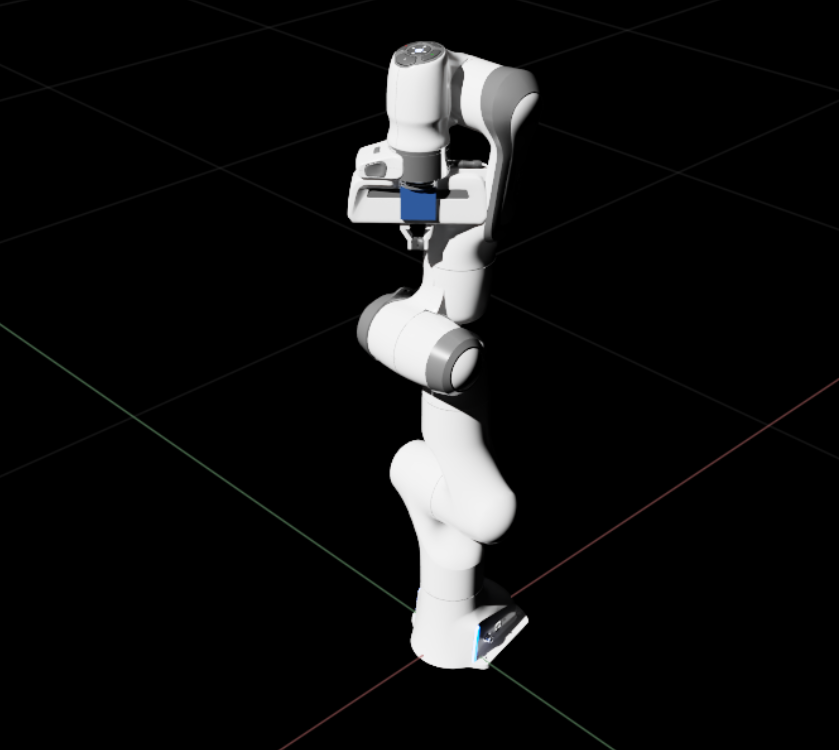
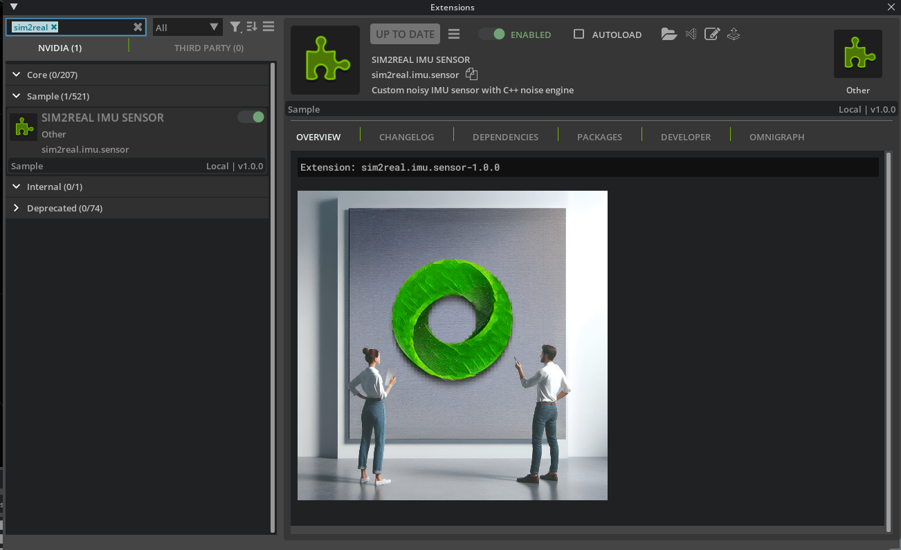
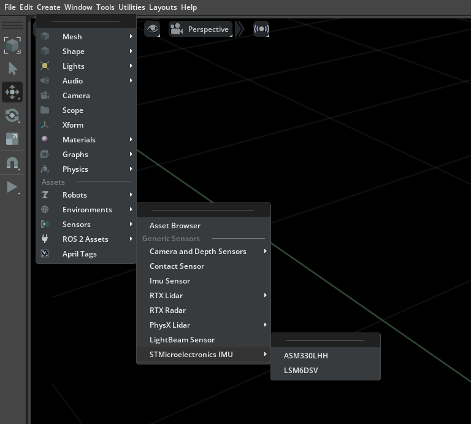
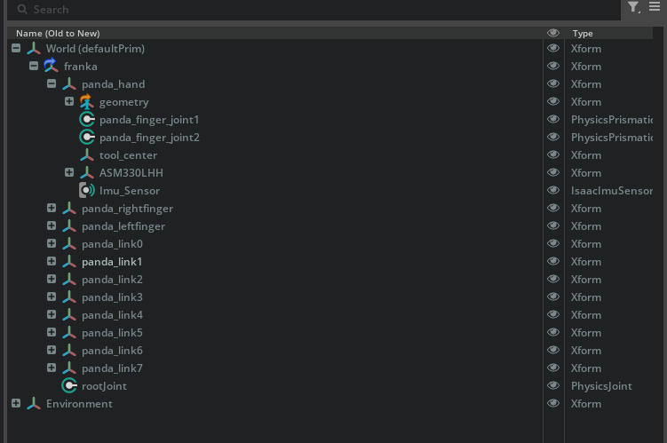
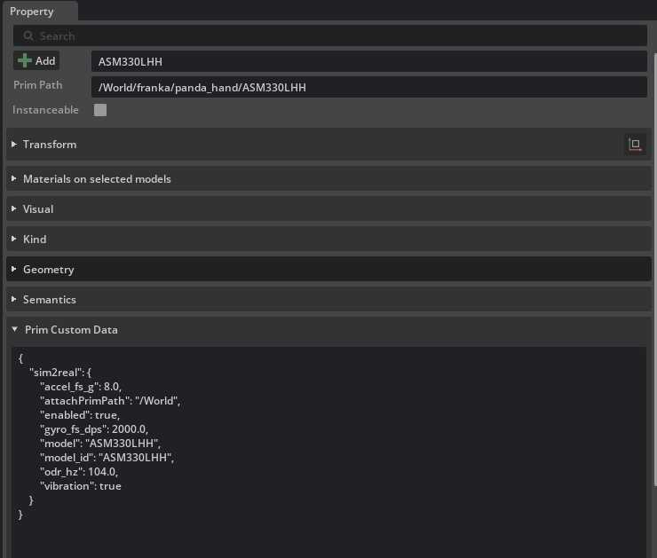
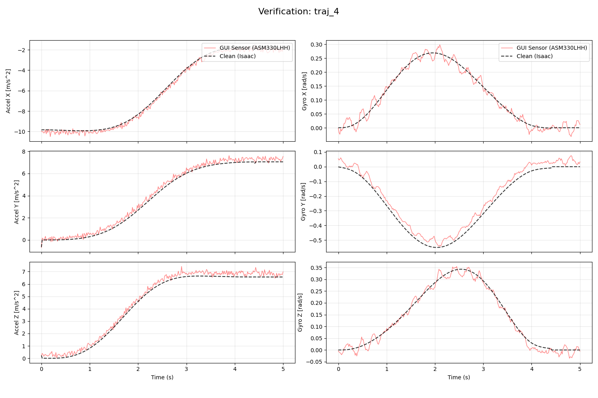

# Nvidia Isaac Sim Extension for STMicroelectronics Sensors

A custom **Isaac Sim** extension that adds STMicroelectronics IMU sensor models directly into the `Create → Sensors` menu. Spawns a physics-driven, realistic IMU prim with a visible viewport marker.



**Supported sensor models:**
- ASM330LHH

> Current public validation baseline: `ASM330LHH`.
> `LSM6DSV` remains an internal placeholder profile and is intentionally hidden from the public Isaac Sim menu until its Sim2Real model is validated.

---

## Features

- ✅ Native Isaac Sim menu integration — no scripting required to place sensors
- ✅ Auto-attaches to whichever prim is selected in the Stage panel
- ✅ Auto-resolves the underlying clean Isaac IMU under the selected link, or auto-creates `Imu_Sensor` if none exists
- ✅ Visible dark navy cube marker in the viewport
- ✅ Physics-step driven runtime ticks each IMU at its configured ODR, independent of render rate
- ✅ Realistic IMU response model with sensor noise, bias drift, and quantization effects
- ✅ Verified against clean Isaac IMU output via included verification scripts

## Requirements

- **Ubuntu 22.04** (tested)
- **Production baseline:** **Isaac Sim Full 5.1.0** with **Python 3.11** — [Installation Guide](https://docs.isaacsim.omniverse.nvidia.com/latest/installation/install_workstation.html)
- **Experimental branch only:** **Isaac Sim 6.0.0 Early Developer Release** with **Python 3.12**
- The compiled **C++ sensor-realism engine**:
  - Bundled for Isaac Sim 5.1.0 / Python 3.11: `sim2real_native_v0_1.cpython-311-x86_64-linux-gnu.so`
  - Experimental branch asset for Isaac Sim 6.0.0 / Python 3.12: `sim2real_native_v0_1.cpython-312-x86_64-linux-gnu.so`
  - Native binaries are platform-specific and must match the Python runtime and target Linux distribution.
  - Ubuntu 22.04 builds must not require a glibc version newer than the OS-provided glibc 2.35.

## Support Matrix

| Line | Isaac Sim | Python | Support Level | Native Backend |
|---|---:|---:|---|---|
| Stable support / production line | 5.1.0 | 3.11 | Stable production baseline on `main` | `sim2real_native_v0_1.cpython-311-x86_64-linux-gnu.so` |
| Experimental branch only | 6.0.0 Early Developer Release | 3.12 | Experimental, isolated branch only | `sim2real_native_v0_1.cpython-312-x86_64-linux-gnu.so` on `experimental/isaac-sim-6.0.0-early-developer-release-python-3.12` |
| Historical tag `v2.1.0` | 5.1.0 | 3.10 | Historical tagged asset set, superseded | `sim2real_native_v0_1.cpython-310-x86_64-linux-gnu.so` in the `v2.1.0` release assets |

> The current `sim_binary/manifest.json` on the stable support line identifies Isaac Sim `5.1.0` / Python `3.11` as the production baseline and still carries Isaac Sim `6.0.0` / Python `3.12` metadata for the isolated experimental branch line.
> Historical `v2.1.0` release notes described the tagged asset state at that time: Isaac Sim `5.1.0` / Python `3.10` and Isaac Sim `6.0.0` / Python `3.12`.
> `main` must track the most stable NVIDIA Isaac Sim release that ST has validated for customers. At this time that baseline is Isaac Sim `5.1.0`, not Isaac Sim `6.0.0` Early Developer Release.
> The source code is shared through an Isaac adapter layer. Release packages must use the `extension.toml` that matches the target Isaac Sim version.

---

## Repository Structure

```
st-mems-isaac-sim2real/
  config/
    extension.toml              # Extension metadata and dependencies
  data/
    models/
      ASM330LHH.json            # ASM330LHH sensor-realism profile and hardware config
      LSM6DSV.json              # Internal placeholder profile, not publicly exposed yet
  sim2real/
    imu/
      sensor/
        adapters/               # Isaac 5.1 / 6.0 compatibility boundary
        __init__.py
        extension.py            # Menu registration, prim spawning
        config.py               # JSON config loader
        runtime.py              # Physics-step subscription + ODR scheduler
        noise/
          __init__.py
          native_backend.py     # C++ pybind wrapper
  imgs/                         # Screenshots for this README
  packaging/
    isaac-5.1.0/extension.toml  # Isaac 5.1 dependency manifest
    isaac-6.0.0/extension.toml  # Isaac 6.0 dependency manifest
  sim_binary/
    manifest.json               # Native backend compatibility metadata
    sim2real_native_v0_1.cpython-311-x86_64-linux-gnu.so
    sim2real_native_v0_1.cpython-312-x86_64-linux-gnu.so
  verification_script.py        # Trajectory logging script
  plot_verification.py          # Plot generator
  README.md
```

---

## Installation

### Step 1 — Clone the repository

```bash
git clone <https://github.com/STMicroelectronics/st-mems-isaac-sim2real>
cd st-mems-isaac-sim2real
```

### Step 2 — Place the extension in your Isaac Sim extensions folder

Select the extension manifest that matches your Isaac Sim version:

```bash
# Isaac Sim 5.1.0
cp packaging/isaac-5.1.0/extension.toml config/extension.toml

# Isaac Sim 6.0.0 Early Developer Release
# Use only from branch: experimental/isaac-sim-6.0.0-early-developer-release-python-3.12
# cp packaging/isaac-6.0.0/extension.toml config/extension.toml
```

Copy the repo contents into your Isaac Sim extensions directory:

```bash
cp -r . /path/to/isaac-sim/exts/sim2real.imu.sensor/
```

> The destination folder must be registered as an extension search path in Isaac Sim.
> To check or add paths: **Window → Extensions → ⚙️ (gear icon) → Extension Search Paths**

### Step 3 — Validate the environment

The extension auto-discovers compatible native backends from `sim_binary/` using `sim_binary/manifest.json`. Set `SIM2REAL_NATIVE_PATH` only when you need to override the bundled backend with another compatible build:

```bash
export SIM2REAL_NATIVE_PATH="/path/to/custom/native/backend"
```

Run the diagnostic from the target Isaac Sim Python environment before enabling the extension:

```bash
./python.sh -m sim2real.imu.sensor.diagnostics --verbose
```

The diagnostic must report `Overall: PASS`. If it reports `FAIL`, the output lists the runtime Python version, expected native backend filename, searched directories, discovered binaries, and exact rejection reason.
It also prints the expected Python ABI for the active runtime and the manifest runtime matrix, for example `Isaac Sim 5.1.0 -> Python 3.11`.
For stage-level timing fidelity, this repo currently recommends a Physics Scene rate of `208 Hz` for the public Sim2Real validation baseline.

Expected diagnostic output on the stable support / production line:

```text
Sim2Real IMU Environment Diagnostics
====================================
Overall: PASS
...
[Sim2Real IMU] Native backend diagnostics:
  Runtime Python: 3.11 (...)
  Expected Python ABI for this runtime: 3.11
  Manifest runtime matrix: Isaac Sim 5.1.0 -> Python 3.11; Isaac Sim 6.0.0 -> Python 3.12
  Compatible native backend candidates:
    PASS .../sim2real_native_v0_1.cpython-311-x86_64-linux-gnu.so (module=sim2real_native_v0_1)
...
[PASS] Physics step configuration
  Steps/sec: 208.0
  Repo baseline recommendation: 208 Hz
```

Expected diagnostic output on the isolated experimental Isaac Sim 6.0.0 branch:

```text
Sim2Real IMU Environment Diagnostics
====================================
Overall: PASS
...
[Sim2Real IMU] Native backend diagnostics:
  Runtime Python: 3.12 (...)
  Expected Python ABI for this runtime: 3.12
  Manifest runtime matrix: Isaac Sim 5.1.0 -> Python 3.11; Isaac Sim 6.0.0 -> Python 3.12
  Compatible native backend candidates:
    PASS .../sim2real_native_v0_1.cpython-312-x86_64-linux-gnu.so (module=sim2real_native_v0_1)
...
[PASS] Physics step configuration
  Steps/sec: 208.0
  Repo baseline recommendation: 208 Hz
```

### Step 4 — Enable the extension

1. Launch Isaac Sim
2. Go to **Window → Extensions**
3. Search for `sim2real`
4. Toggle **Sim2Real IMU Sensor** on



5. Check the console for:

```
[Sim2Real IMU] Native C++ backend loaded successfully.
[Sim2Real Runtime] Physics step subscription active.
```

6. *(Optional)* Check **AUTOLOAD** to enable automatically on every launch.

---

## Usage

### Placing a Sensor

1. Load a robot into your scene
2. In the **Stage** panel, click the link you want to attach the sensor to (e.g. `panda_hand`)
3. From the top menu: `Create → Sensors → STMicroelectronics IMU → ASM330LHH`



4. The sensor appears as a child prim of your selected link with a navy cube visible in the viewport



5. Select the IMU prim and inspect **Properties** to confirm the config was applied



6. Press **Play** — the Sim2Real engine resolves the clean Isaac IMU from `sim2real:truthImuPrimPath`, from a child IMU-like prim under the selected link, or auto-creates `/Imu_Sensor` as a fallback
7. The Sim2Real engine then ticks automatically at the sensor's configured ODR

---

## Sensor Configuration

Each model's sensor-realism profile lives in `data/models/<model>.json`. Edit these files to tune the sensor — **no code changes required**.

```json
{
    "model_id": "ASM330LHH",
    "accel_fs_g": 8.0,
    "gyro_fs_dps": 2000.0,
    "odr_hz": 104.0,
    "vibration": true
}
```

| Parameter | Description |
|---|---|
| `accel_fs_g` | Accelerometer full-scale range (g) |
| `gyro_fs_dps` | Gyroscope full-scale range (deg/s) |
| `odr_hz` | Output data rate (Hz) |
| `vibration` | Enable structural vibration model |

> Config changes take effect the next time you place a sensor. Delete and re-place the prim to apply new values. All internal noise parameters (bias drift, white noise, quantization) are fixed in the C++ engine and not user-configurable.

### Adding a New Sensor Model

1. Create `data/models/<NewModel>.json` with the hardware specs
2. Add one entry to the submenu in `extension.py`:
```python
MenuItemDescription(
    name="NewModel",
    onclick_fn=lambda: self._spawn_sensor("NewModel"),
),
```
3. Toggle the extension off and on

---

## Verification

Included scripts let you validate the Sim2Real IMU response against clean Isaac IMU output.

### Run the verification script

If you are using a minimal Isaac Sim pip/conda environment, install the verification dependencies first:

```bash
pip install -r requirements.txt
```

Before verification, configure the current stage Physics Scene to the repo baseline of `208 Hz`:

```bash
./python.sh packaging/configure_physics_scene.py --steps-per-second 208
```

1. Load a stage with a Franka robot
2. Select `panda_hand` in the Stage panel and place an ASM330LHH sensor via the menu
3. Open **Window → Script Editor**
4. Paste and run `verification_script.py`
5. Press **Play** — 5 trajectories log automatically to `~/Documents/trajectories_verification/`

### Generate plots

```bash
python3 plot_verification.py
```

Each `traj_N/` folder gets a `verification_plot.png` showing clean Isaac output vs realistic Sim2Real IMU output across all 6 axes:



The Sim2Real trace (red) should follow the clean motion profile (black dashed) with realistic sensor effects, including noise and bias drift.

---

## Troubleshooting

**Extension not found in manager**
```bash
find /path/to/exts/sim2real.imu.sensor -type f
```
Confirm all files are present including `noise/__init__.py`.

**C++ backend fails to load**
- Run the environment diagnostic from Isaac's Python:
```bash
./python.sh -m sim2real.imu.sensor.diagnostics --verbose
```
- Read the first ABI lines in the report before changing paths:
  - `Runtime Python: ...`
  - `Expected Python ABI for this runtime: ...`
  - `Manifest runtime matrix: Isaac Sim 5.1.0 -> Python 3.11; Isaac Sim 6.0.0 -> Python 3.12`
- Read the physics section as well:
  - `Steps/sec: ...`
  - `Repo baseline recommendation: 208 Hz`
- If you set `SIM2REAL_NATIVE_PATH`, verify it points to the folder or file containing a compatible `sim2real_native*.so`
- Confirm the `.so` matches the Python version bundled with your Isaac Sim runtime
- A typical ABI mismatch looks like:
```text
Python ABI mismatch: runtime 3.11, binary 3.10
```
  This means the runtime and native backend were built for different Python ABIs. Use the backend that matches the runtime reported by the diagnostic.
- If you are comparing against the historical `v2.1.0` release notes, note that `main` now expects the bundled Isaac Sim 5.1.0 backend to be Python 3.11.
- If the error mentions `GLIBC_x.y not found`, do not manually upgrade system glibc. Use a backend rebuilt on the target OS/version instead.

**`plot_verification.py` fails with `ModuleNotFoundError: No module named 'pandas'`**
- Install the plotting dependencies from the repo root:
```bash
pip install -r requirements.txt
```
- `requirements.txt` covers only the verification and plotting scripts. Isaac Sim's `omni.*` packages still come from Isaac itself.

**Sim2Real sensor spawns, but no realistic IMU data appears**
- Inspect the spawned sensor prim custom data in **Properties**:
  - `sim2real:attachPrimPath`
  - `sim2real:truthImuPrimPath`
- The runtime now resolves the clean Isaac IMU in this order:
  1. explicit `sim2real:truthImuPrimPath`
  2. default child `<attachPrimPath>/Imu_Sensor`
  3. first IMU-like descendant under the attached link
  4. auto-create `<attachPrimPath>/Imu_Sensor`
- If the sensor is added before a physics scene exists, the runtime defers truth IMU binding and retries automatically once physics is available. You should not need to delete and re-add the ST sensor.
- For the current public Sim2Real baseline, configure the Physics Scene to `208 Hz` to reduce ODR timing quantization and validation drift.
- If your stage uses a specific native IMU prim path, set `sim2real:truthImuPrimPath` directly on the Sim2Real sensor prim.
- If auto-creation fails, check the console for `Could not initialize native Isaac sensor` and `Hint: set sim2real:truthImuPrimPath explicitly`.

**Menu shows but cube is not visible in viewport**
- Toggle the extension off and on
- Check the console for Python errors
- Run this in the Script Editor to confirm the prim exists:
```python
import omni.usd
stage = omni.usd.get_context().get_stage()
prim = stage.GetPrimAtPath("/World/franka/panda_hand/ASM330LHH/visual")
print("Visual prim exists:", prim.IsValid())
```

**Realistic IMU profile looks too clean or too aggressive**
- Edit `data/models/ASM330LHH.json` directly
- Delete and re-place the sensor prim to pick up the new values
- Rerun `verification_script.py` and `plot_verification.py` to verify

---

## Tested On

| Line | Isaac Sim | Python | Ubuntu | Validation Scope |
|---|---|---|---|---|
| Stable support / production line | 5.1.0 | 3.11 | 22.04 | Current validated production baseline |
| Experimental branch | 6.0.0 Early Developer Release | 3.12 | 22.04 | Experimental branch validation only |
| Historical release `v2.1.0` | 5.1.0 | 3.10 | 22.04 | Historical tagged release asset set, superseded |

Validation hardware reference: NVIDIA GeForce RTX 3060.

---

## Development And Release Discipline

- Use an isolated Python environment for local tooling: Conda, `venv`, or Isaac's bundled Python.
- Do not run release validation from system Python unless explicitly using `--allow-system-python` in CI.
- Use compatibility-specific branches for changes that touch Isaac, Python, Ubuntu, glibc, or native backend behavior:
```text
support/isaac-sim-5.1.0-python-3.11-stable
experimental/isaac-sim-6.0.0-early-developer-release-python-3.12
hotfix/isaac-sim-5.1.0-python-3.11-native-backend
release/v2.1.1
```
- Branch names must encode the compatibility axis being changed when relevant: Isaac version, Python ABI, Ubuntu version, glibc floor, or native backend module name.
- `support/...` means a long-lived customer support line anchored to the current stable production baseline.
- `experimental/...` means isolated forward-looking work that must not redefine `main` until the upstream platform becomes stable and is fully revalidated.
- Before tagging a release, run:
```bash
python packaging/validate_manifest.py
python packaging/validate_release_zip.py --isaac 5.1.0 path/to/sim2real-imu-isaac-5.1.0-vX.Y.Z.zip
```

For isolated experimental Isaac Sim 6.0.0 work, run the 6.0.0 ZIP validator only from the experimental branch:

```bash
python packaging/validate_release_zip.py --isaac 6.0.0 path/to/sim2real-imu-isaac-6.0.0-vX.Y.Z.zip
```
